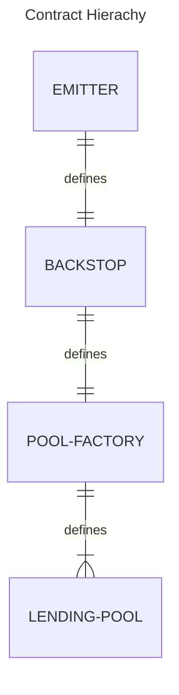

# Core Contracts

Blend is segmented into 4 immutable core contracts:

## Emitter Contract

The Emitter contract is Blend's unifying contract. It mints and distributes Blend tokens to the backstop contract. The Emitter can be thought of as the "entry point" for the protocol. It stores the address of the backstop, which stores the address of the pool factory, which stores the addresses of deployed pools.

The backstop address can be swapped through a backstop swap. Doing so would allow the pool factory and lending pool addresses to be modified as well.

## Backstop Contract

The Backstop Contract holds funds that are used to insure Blend pools. If a liquidation results in a pool taking on bad debt, backstop funds will cover the loss. In addition, the backstop manages the distribution of the Blend tokens it receives from the Emitter.

## Pool Factory Contract

The Pool Factory Contract is responsible for deploying new lending pools. It stores the addresses of deployed pools and can be queried to check if a pool was deployed by it.

## Lending Pool Contract

Lending Pool contracts facilitate lending, borrowing, and liquidations. They also distribute Blend tokens received from the backstop contract.
