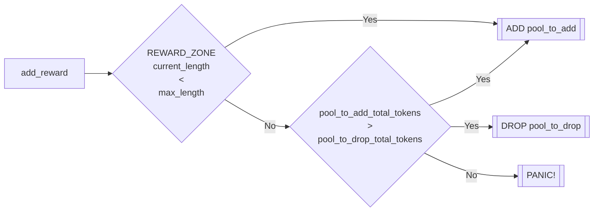

# Emission Distribution

The Backstop contract is responsible for distributing emissions to backstop depositors and lending pools after it receives them from the emitter contract.

## Reward Zone

Emissions are only distributed to pools in a `reward_zone`, which the backstop contract manages, and backstop depositors designating their deposits to those pools.

### Reward Zone Length

The number of pools that can be added to the reward zone starts at 10 and increases by one approximately every 3 months. This is done to prevent liquidity fragmentation by ensuring only a select number of pools receive emissions.

### Adding Pools to the Reward Zone

Pools can be added to the Reward Zone by calling the `add_reward()` function. This function intakes a potential pool to drop from the reward zone and attempts the addition with the following process:


If the pool being added to the reward zone has not met the minimum backstop threshold `add_reward()` will fail.



If the to\_remove pool is not in the reward zone, `add_reward()` will fail.



If the pool is already in the reward zone, `add_reward()` will fail.


## Emission Management

The backstop contract facilitates both emission distribution and backstop emissions claims.

### Emission Distribution

Emissions are distributed to backstop depositors and pools by calling the `gulp_emissions()` function which:


Anyone may call `gulp_emissions()` - it's expected that someone will run a bot to do so


1. Calculates the `new_emissions` received from the emitter which&#x20;
   1. equal to `emitter_last_distribution_time - backstop_last_distribution_time`&#x20;


At least one hour must have passed between `emitter_last_distribution_time` and `backstop_last_distribution_time` or this `gulp_emissions()` will fail. This is to prevent rounding issues&#x20;


2. Calculates the amount of emissions to allocate to backstop depositors and pools&#x20;
   1. Backstop depositors get 70% of new emissions&#x20;
   2. Pools get 30% of new emissions&#x20;
3. Sets emissions per second for backstop depositors&#x20;
   1. equal to `(backstop_emissions * pool_backstop_tokens / total_backstop_tokens_in_reward_zone_pools) + remaining_emissions / 7 days)`&#x20;


This EPS will expire in 7 days, so emissions must be gulped every 7 days, or backstop depositors will stop receiving emissions until emissions are gulped again. Emissions not distributed during a gulp gap will be accrued in the next gulp call.



&#x20;Backstop deposits queued for withdrawal will not count towards either`total_backstop_tokens_in_reward_zone_pools` or `pool_backstop_tokens` in the emission distribution calculations


4. &#x20;Sets emissions earned by each pool&#x20;
   1. equal to `pool_emissions * pool_backstop_tokens / total_backstop_tokens_in_reward_zone_pools`&#x20;

### Emission Claims

The backstop facilitates emission claims by backstop depositors. Backstop depositors can claim their emissions by calling the `claim()` function which transfers the user's earned emissions for all input pool addresses to the user and reduces the user's accrued emissions to 0.

All claimed emissions are automatically deposited into the backstop and allocated to the pool they were earned in.


Users can claim their emissions and deposit them on behalf of another user by specifying the user in the `to` parameter in the `claim()` function.&#x20;

