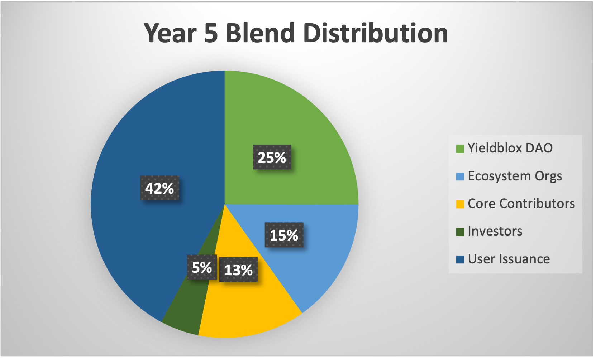
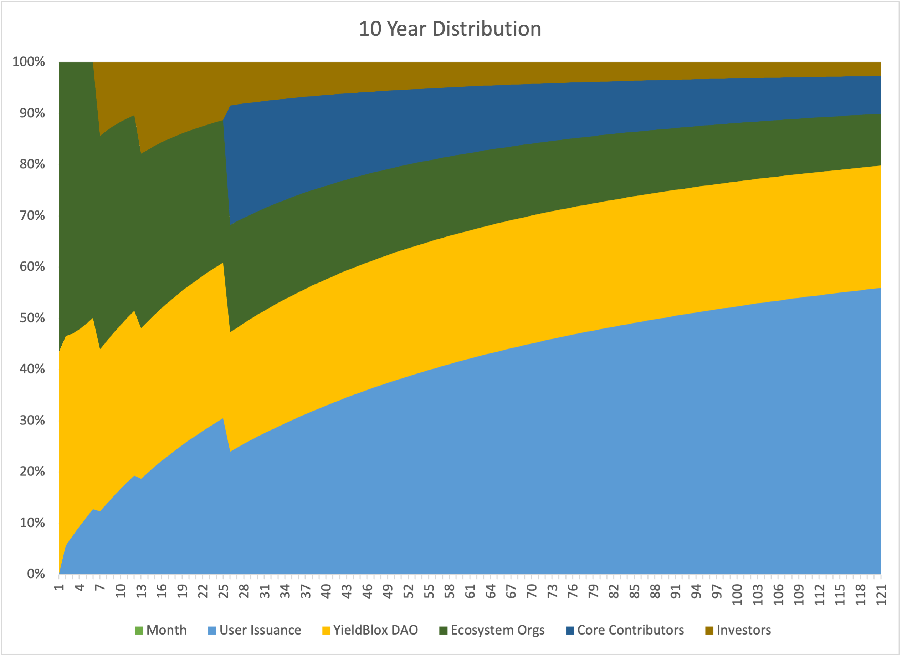

# BLND Token

## BLND Tokens

### What are BLND tokens?

BLND is Blend's protocol token. BLND tokens are emitted to users by the protocol and can be deposited in backstop modules in order to insure lending pools.

### What is the BLND asset?

[https://stellar.expert/explorer/public/asset/BLND-GDJEHTBE6ZHUXSWFI642DCGLUOECLHPF3KSXHPXTSTJ7E3JF6MQ5EZYY-1](https://stellar.expert/explorer/public/asset/BLND-GDJEHTBE6ZHUXSWFI642DCGLUOECLHPF3KSXHPXTSTJ7E3JF6MQ5EZYY-1)

### How do I get BLND tokens?

Users receive BLND tokens just for using the Blend Protocol!

Lenders and borrowers receive emissions if the pool they're using is in the [reward zone](../blend-whitepaper.md#reward-zone) and has allocated emissions to lenders or borrowers of the asset they're lending or borrowing. 30% of BLND emissions are distributed to pools in the reward zone, and they're split between pools based on how large the pool's backstop deposit is.&#x20;

Backstop depositors always receive emissions. 70% of BLND emissions are distributed to backstop depositors.\

Emissions must claim them from either the pool or backstop (depending on how they were earned) to receive their issued BLND. When users claim backstop emissions, the earned BLND is deposited into the [BLND:USDC 80:20 liquidity pool](backstopping.md#what-are-blnd-usdc-80-20-liquidity-pool-shares), and the shares are deposited into the backstop module for the pool the user was backstopping or using.  Emissions earned from lending and borrowing are simply transferred to the user for them to do with as they wish.

### How many BLND tokens are there?

49 million BLND tokens were emitted upon protocol launch using [the Drop function](../blend-whitepaper.md#emissions-drop). After that, the protocol will emit 1 BLND per second to users. The initially minted tokens will be distributed as follows:

*   7,000,000 BLND to YieldBlox DAO

    These tokens will be sent to the YieldBlox DAO treasury. They can be used immediately.
*   5,250,000 BLND to Ecosystem Organizations

    These tokens will be distributed to custom lockup contracts which allow organizations to use BLND in the protocol, but not to transfer them for 4 years. The purpose of this distribution is to help early adopters of Blend bootstrap their pools.
*   27,000,000 BLND to core contributors

    These tokens will be distributed to lockup smart contracts where they cannot be accessed for 2 years.
*   9,750,000 BLND to investors

    These tokens will be distributed to lockup smart contracts that allow half to be accessed after 6 months, and the remainder to be accessed after a year.

Token Distribution Visualized (CURRENTLY OUTDATED)

<figure><figcaption></figcaption></figure>

<figure><figcaption></figcaption></figure>

Assumptions:

* Yieldblox DAO and Ecosystem Organizations deposit all their BLND in the backstop module.

### Was there a BLND airdrop?

No.
