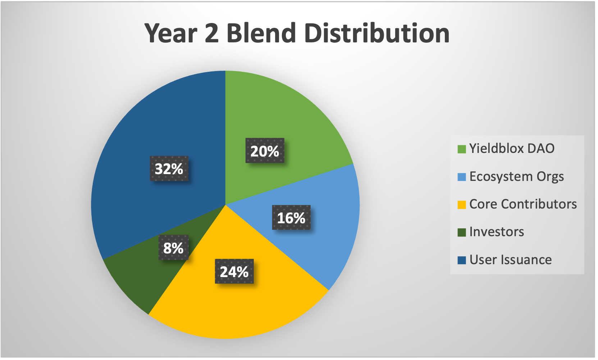

# BLND Token

## BLND Tokens

### What are BLND tokens?

BLND tokens are Blend's platform token. They're emitted to users by the protocol, and can be deposited in lending pool's Backstop Modules in order to insure the pool.

### What is the BLND issuer address?

TBD

### How do I get BLND tokens?

Users receive BLND tokens just for using the Blend Protocol. They must claim them from either the pool or backstop (depending on how they were earned) to receive their issued BLND.

### How many BLND tokens are there?

50 million BLND tokens will be emitted upon protocol launch (using the Drop() function). After that, the protocol will emit 1 BLND per second to users. The initially minted tokens will be distributed as follows:\\

*   5,750,000 BLND to YieldBlox DAO

    These tokens will be sent to the YieldBlox DAO treasury. They can be used immediately
*   7,500,000 BLND to Ecosystem Organizations

    These tokens will be distributed to custom lockup contracts that allow organizations to use BLND in the protocol, but not to transfer them for 4 years. The purpose of this distribution is to help early adopters of Blend bootstrap their pools
*   27,000,000 BLND to core contributors

    These tokens will be distributed to lockup smartcontracts where they cannot be accessed for 2 years
*   9,750,000 BLND to investors

    These tokens will be distributed to lockup smartcontracts that allow half to be accessed after 6 months, and the remainder to be accessed after a year.

Token Distribution Visualized

<figure><figcaption></figcaption></figure>

<figure><figcaption></figcaption></figure>

Assumptions:

* Yieldblox DAO and Ecosystem Organizations deposit all their BLND in the backstop module

### Was there a BLND airdrop?

No.
